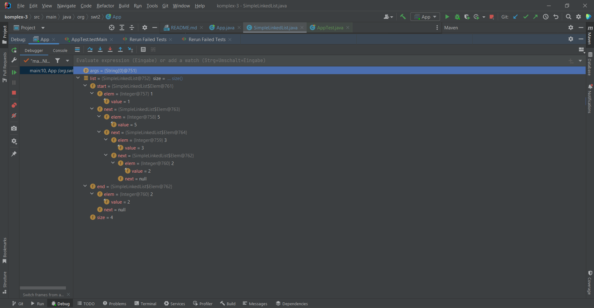

## Lösung Aufgabe 3

### 3.
- Einfügen in _src/main/java/..._
- _mvn compile_ zum Kompilieren
- _mvn test_ zum Testen

### 4.
JUnit5 und AssertJ werden mithilfe von Maven Dependencies zum Projekt hinzugefügt.
Dafür wird in der pom.xml in dem Element <dependencies\> die jeweilige Dependency als Unterelement eingefügt.

### 5.
Jacoco wird in die pom.xml als <plugin\> eingefügt. Zunächst wird ein Agent erstellt, der die ausgeführten Zeilen der Tests registriert. Dies wird in einem Report zusammengefasst, der mit dem kompilierten Ergebnis in _target_ landet.
Jacoco testet die Code-Abdeckung durch Tests.

### 6.
Tests erstellt:
- SimpleLinkedList
  - add
  - null-check
  - empty-check
  - size
  - comparison
  - iterator
    - next()
    - hasNext()
    - remove()
- App
  - main()

### 7.
Alle Warnungen des Java-Compilers können mit javac -X aktiviert werden.
Spotbugs wird, ähnlich wie Jacoco, als Plugin in die pom.xml eingefügt.

TODO

### 8.
Der Debugger von IntelliJ kann mithilfe von Breakpoints genutzt werden. Diese werden neben der betroffenen Zeile als roter Punkt dargestellt.
Das Programm hält an der markierten Stelle an. IntelliJ und andere IDEs zeigen den aktuellen Stand aller Variablen an. 
Im Screenshot sieht man den verketteten Aufbau der SimpleLinkedList. Die Variable _start_ beinhaltet das erste Element und die jeweilige Verknüpfung zum nächsten Element. Zusätzlich erkennt man, dass die Variable _end_ korrekt definiert ist, wenn man das letzte Element von _start_ vergleicht. Zudem ist die _size_ richtig inkrementiert.

